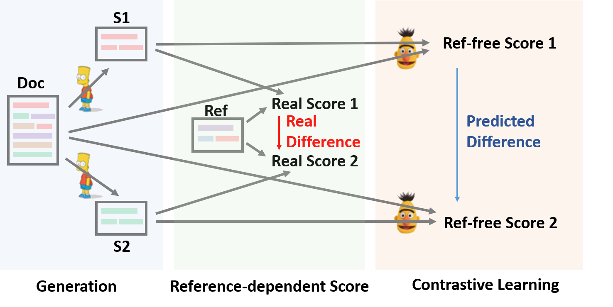

# SimCLS: A Simple Framework for Contrastive Learning of Abstractive Summarization (ACL 2021)


## Overview
SimCLS is a conceptually simple while empirically powerful framework for abstractive summarization, which can bridge the gap between the *learning objective* and *evaluation metrics* resulting from the currently dominated sequence-to-sequence learning framework by **formulating text generation as a reference-free evaluation problem} (i.e., quality estimation)** assisted by *contrastive learning*.

As shown below, SimCLS framework consists of for two stages: Candidate Generation and Reference-free evaluation, where Doc, S, Ref} represent the document, generated summary and reference respectively.

<div  align="center">
 
</div>


## 1. How to Install

### Requirements
- `python3`
- `conda create --name env --file spec-file.txt`
- `pip3 install -r requirements.txt`
- `compare_mt` -> https://github.com/neulab/compare-mt

### Description of Codes
- `main.py` -> training and evaluation procedure
- `model.py` -> models
- `data_utils.py` -> dataloader
- `utils.py` -> utility functions
- `preprocess.py` -> data preprocessing

### Workspace
Following directories should be created for our experiments.
- `./cache` -> storing model checkpoints
- `./result` -> storing evaluation results

## 2. Preprocessing
We use the following datasets for our experiments.

- CNN/DailyMail -> https://github.com/abisee/cnn-dailymail
- XSum -> https://github.com/EdinburghNLP/XSum

For data preprocessing, please run
```
python preprocess.py --src_dir [path of the raw data] --tgt_dir [output path] --split [train/val/test] --cand_num [number of candidate summaries]
```
`src_dir` should contain the following files (using test split as an example):
- `test.source`
- `test.source.tokenized`
- `test.target`
- `test.target.tokenized`
- `test.out`
- `test.out.tokenized`

Each line of these files should contain a sample. In particular, you should put the candidate summaries for one data sample at neighboring lines in `test.out` and `test.out.tokenized`.

The preprocessing precedure will store the processed data as seperate json files in `tgt_dir`.

We have provided an example file in `./example`.

## 3. How to Run

### Preprocessed Data
You can download the preprocessed data for our experiments on [CNNDM](https://drive.google.com/file/d/1WRvDBWfmC5W_32wNRrNa6lEP75Vx5cut/view?usp=sharing) and [XSum](https://drive.google.com/file/d/1nKx6RT4zNxO4hFy8y3dPbYV-GBu1Si-u/view?usp=sharing).

After donwloading, you should unzip the zip files in this root directory.

### Hyper-parameter Setting
You may specify the hyper-parameters in `main.py`.

To reproduce our results, you could use the original configuration in the file, except that you should make sure that on CNNDM 
`args.max_len=120`, and on XSum `args.max_len = 80`.


### Train
```
python main.py --cuda --gpuid [list of gpuid] -l
```
### Fine-tune
```
python main.py --cuda --gpuid [list of gpuid] -l --model_pt [model path]
```
model path should be a subdirectory in the `./cache` directory, e.g. `cnndm/model.pt` (it shouldn't contain the prefix `./cache/`).
### Evaluate
```
python main.py --cuda --gpuid [single gpu] -e --model_pt [model path]
```
model path should be a subdirectory in the `./cache` directory, e.g. `cnndm/model.pt` (it shouldn't contain the prefix `./cache/`).

## 4. Results

### CNNDM
|          | ROUGE-1 | ROUGE-2 | ROUGE-L |
|----------|---------|---------|---------|
| BART     | 44.39   | 21.21   | 41.28   |
| Ours     | 46.67   | 22.15   | 43.54   |

### XSum
|          | ROUGE-1 | ROUGE-2 | ROUGE-L |
|----------|---------|---------|---------|
| Pegasus  | 47.10   | 24.53   | 39.23   |
| Ours     | 47.61   | 24.57   | 39.44   |

Our model outputs on these datasets can be found in `./output`.

We have also provided the finetuned checkpoints on [CNNDM](https://drive.google.com/file/d/1CSFeZUUVFF4ComY6LgYwBpQJtqMgGllI/view?usp=sharing) and [XSum](https://drive.google.com/file/d/1yx9KhDY0CY8bLdYnQ9XhvfMwxoJ4Fz6N/view?usp=sharing).
